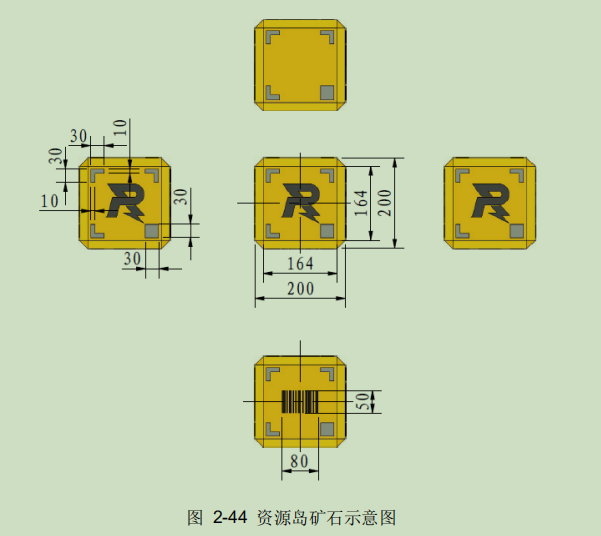
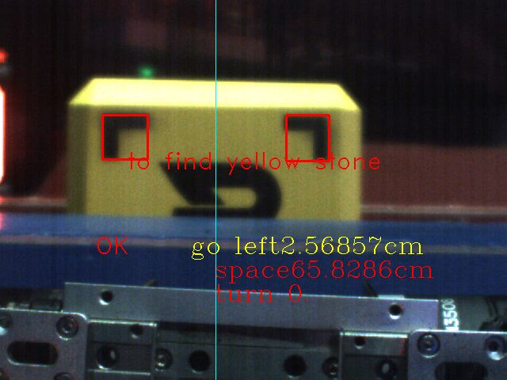

## 2021吉林大学tarsgo战队工程视觉代码

### 文件树

|-- CMakeLists.txt

|-- GxCamera  # 大恒相机驱动

|   |-- GxCamera.cpp

|   |-- GxCamera.h

|   |-- include

|       |-- DxImageProc.h

|       |-- GxIAPI.h

|-- Serial  # 串口通信

|   |-- Serial.cpp

|   |-- Serial.h

|-- stone.cpp  # 检测源文件

|-- stone.h  # 检测头文件

|-- stone_detect.cpp  # 检测入口

|-- README.md

### 运行环境

| 操作系统     | 运算平台        | 相机型号 |
| ------------ | --------------- | -------- |
| Ubuntu 18.04 | Jeston Nano b02 | 大恒相机 |

代码可在分辨率为640*480帧率达到60fps

工程车主要负责兑换弹丸与救援，在比赛中，工程机器人需要到达矿石掉落点夹取矿石，前往兑换点使其条码面朝下通过扫面并推入兑换仓库即兑换成功，此代码为夹取矿石的视觉辅助对正，并在比赛中取得不错的效果。

矿石为正方体，且每一面都有明显的视觉标签,根据这四个视觉标签即可很方便的确定矿石的方向



### 算法主体逻辑

先将采集到的图转到HSV,由此根据阈值找出矿石疑似区域，之后根据面积，宽高比等判断条件找出矿石近似区域，并以此区域作为ROI用于后续的检测，在此区域进行视觉标签的检测，经过一系列图像处理与阈值判断识别出左标签，右标签与全黑标签，根据此位置一一对应关系判断矿石的朝向是否正确，根据标签之间的像素距离与实际距离计算出相机与矿石中心的偏移距离，利用小孔成像原理计算出相机与矿石的垂直距离。

## 角度解算
由于相机采集到的图片只可得到二维信息，并无法感知物体的深度信息，但如果进行视觉辅助对正的话需要得到世界坐标系下的深度距离与小车左右移动距离。
### 焦距计算
假设我们有一个宽度为 W 的目标或者物体。然后我们将这个目标放在距离我们的相机为 D 的位置。我们用相机对物体进行拍照并且测量物体的像素宽度 P 。这样我们就得出了相机焦距的公式：

F = (P x D) / W

### 距离计算
利用相似三角形得到相机距离物体的距离。
此时的距离： D’ = (W’ x F ) / P’。

**这里测量的距离是相机到物体的垂直距离，产生夹角，测量的结果就不准确了**，故比赛采取的先撞一下资源岛，使车与矿石保持平行状态

### 细节处理
- 当只出现一个视觉标签时，也可以进行距离解算
- 当矿石不规则落下，可以识别视觉标签位置，并在兑换之前进行旋转
## 串口通信
- 上位机需要发送左右距离与前后距离给下位机
- 下位机需要发送识别模式(金矿或者银矿)给上位机
将角度解算得到的距离信息通过串口发送给下位机，下位机利用pid速度环控制小车移动使其距离达到理想值收敛

**注意**

- nano有自带的串口总是有问题，所以我们使用USB转TTL,更加稳定
- 上下机约定好帧结构，将所要发的数据按照数组方式发送
- 上场之前需要开机自启动，并加入看门狗防止崩溃退出

*但是nano的自启动有问题，一旦加入自启动帧率就直接降到5帧，一直没有想到好的方法解决，比赛用的是开机手动开启*

流程图：

 ```mermaid
 graph TD
     入口-->传入检测模式-->转HSV-->|金矿|筛选矿石区域-->视觉标签检测-->获得完整矿石-->计算左右偏差与前后距离-->数据传送至下位机
     转HSV-->|银矿| 筛选矿石区域
 ```


## 比赛时最终效果


### 不足

- 串口通信在nano下为阻塞模式，极大影响帧率
- 在光照不同的条件下，矿石区域的识别会受到很大影响，需在赛场根据实际情况调整对应阈值
- 必须要求车与矿石平行，且无法对不规则掉落矿石进行识别

